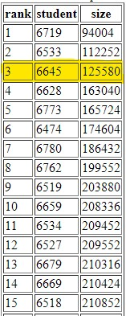
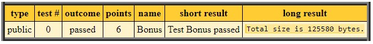

# 💻 WLP4Compiler 💻
The WLP4 Compiler was a compiler that implements scanning, parsing, context sensitive analysis, and code generation of WLP4 Code. The end product was to write a compiler that translates WLP4 code into MIPS assemble language. WLP4 is a subset of the C++ language, and includes functions, integers, pointers, arrays, conditional statements, and while loops.
The source code for this program is kept secret because the compiler was built as a part of the CS241 course. Feel free to email me at <a href="bhagat.kush.a@gmail.com">bhagat.kush.a@gmail.com</a> to see it.

---
## 🔧 Process to build the compiler 🔧
The compiler was built by first tokenizing/scanning the WLP4 code. Scanning was implemented using a <a href="https://en.wikipedia.org/wiki/Maximal_munch">Simplified Maximal Munch Algorithm</a>, that attempts to consume input until it gets stuck, at which point it determines whether or not the input is in an accepting state. If the input is in an accepting state, then a token is produced, otherwise it will not backtrack and reject the input. The algorithm made scanned through the code using an <a href="https://en.wikipedia.org/wiki/Nondeterministic_finite_automaton">NFA</a>, where the lexical syntax used can be found <a href="https://student.cs.uwaterloo.ca/~cs241/wlp4/WLP4.html">here</a> <!-- A6 P1 -->

Because of the limitations of regular languages when trying to represent arbitrary nesting of something like parentheses, we implemented parsing using <a href="https://en.wikipedia.org/wiki/Pushdown_automaton">Pushdown Automata</a> to recognize whether or not the code can be recognized using a <a href="https://en.wikipedia.org/wiki/Context-free_grammar">Context Free Grammar (CFG)</a>. The language in question here can be found <a href="https://student.cs.uwaterloo.ca/~cs241/wlp4/WLP4.html">here</a>. The end goal of parsing is to generate a derivation of the input string given a CFG. This derivation uniquely defines a parse tree which we can use to represent the structure of the program. Within this compiler, we made use of <a href="https://en.wikipedia.org/wiki/Bottom-up_parsing">Bottom-Up Parsing</a> specifically the <a href="https://en.wikipedia.org/wiki/Canonical_LR_parser">LR(1)</a> parser.

The next step of the compiler was to identify whether the code followed the context-sensitive rules of WLP4. Two of these rules that are very common in a lot of languages are...
- Not declaring two variables with the same name
- A variable cannot be used before it is declared

The full set of semantic rules (type-inference rules) can be found <a href="https://student.cs.uwaterloo.ca/~cs241/wlp4/typerules.pdf">here</a>, while the full set of context-sensitive rules can be found <a href="https://student.cs.uwaterloo.ca/~cs241/wlp4/WLP4.html">here</a>. The process here wasn't too complicated, the compiler simply had to parse through the parse tree (build in the parsing section) and ensure that each of the rules were being followed.

Definitely my favourite part of the compilation process was code generation. There wasn't any hand wavy algorithm that we could use for this portion, it was just identifying an optimal approach that we could use to generate MIPS code. The real challenge came when trying to optimize the code generation. In the end, the course challenged the students to reduce the size of the MIPS program that the compiler generates for a particular WLP4 program. Many optimization techniques were used like <a href="https://en.wikipedia.org/wiki/Constant_folding">Constant Folding, Constant Propogation</a>, <a href="https://en.wikipedia.org/wiki/Strength_reduction">Strength Reduction</a>, and <a href="https://en.wikipedia.org/wiki/Dead_code_elimination">Dead Code Elimination</a> just to name a few. In the end, I was able to get the bonus marks, as well as coming in third place.

Was it worth the bonus marks though??? Probably not, but I absolutely enjoyed the challenge!
